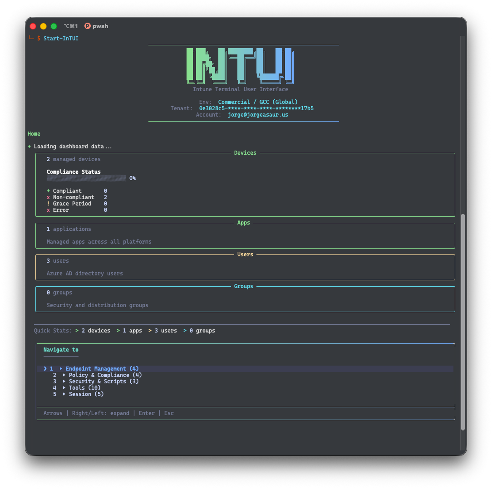

# InTUI - Intune Terminal User Interface

A PowerShell terminal UI for managing Microsoft Intune resources via Microsoft Graph API. Uses a custom ANSI TUI engine with Catppuccin Mocha colors, Unicode box-drawing, gradient decorations, and flicker-free cursor-positioned redraws. Mimics the Intune admin center experience directly in your terminal.


<p align="center">
  
</p>


## Features

- **Devices** - Browse all managed devices, filter by OS (Windows, iOS, macOS, Android), view compliance overview, device details with hardware info, Defender threat status panel, execute remote actions (sync, restart, rename, retire, wipe), and bulk operations
- **Apps** - Browse all managed apps, filter by platform or type (Win32, Store, Web, M365), view assignments, monitor device/user install status, view Win32 app dependencies, create app assignments, and bulk assign to groups
- **App Protection** - Browse iOS, Android, and Windows MAM policies, view VPP token status and license tracking
- **Users** - Browse and search users, view managed devices, app installations, group memberships, and license details
- **Groups** - Browse security, M365, and dynamic groups, view members, owners, device members, and dynamic membership rules
- **Configuration Profiles** - Browse device configuration profiles, filter by platform, view assignments, device status summaries, and conflict detection
- **Compliance Policies** - Browse compliance policies by platform, view assignments, per-setting status, and device compliance states
- **Scripts & Remediations** - Browse PowerShell scripts and proactive remediations, view assignments, device run states, and script content
- **Enrollment** - View Autopilot devices and deployment profiles, enrollment configurations (ESP), Apple Push Certificate status, and Apple DEP/ABM token management
- **Security** - Browse security baselines, endpoint protection policies, lookup BitLocker recovery keys, and Defender overview dashboard
- **Conditional Access** - Browse CA policies (read-only), view named locations, and filter sign-in logs
- **Reports** - Stale device reports, app install failure summaries, license utilization, compliance trend charts, and enrollment trend charts
- **What's Applied** - Unified view of all policies, profiles, and apps targeting a specific device or user
- **Multi-Tenant** - Save tenant profiles for quick switching and tenant health summary on connect
- **Dashboard** - Summary panels with device, app, user, and group counts plus compliance statistics, with live auto-refresh mode
- **Connection Wizard** - Interactive TUI-driven connection flow with cloud environment selection, auth method choice (browser, device code, service principal), and saved tenant profiles

### Tools

- **Global Search** - Search across devices, apps, users, and groups simultaneously
- **Command Palette** - Quick navigation to any view via fuzzy search
- **Keyboard Shortcuts** - Vim-style navigation with shortcut bar and help overlay
- **Bookmarks** - Save and recall frequent navigation paths
- **Navigation History** - Recently visited views for quick re-navigation
- **Script Recording** - Record Graph API actions and export as replayable PowerShell scripts
- **Caching** - Local response caching with configurable TTL for faster navigation
- **Assignment Conflicts** - Detect groups targeted by multiple policies with conflicting settings
- **Error Code Lookup** - Maps common Intune error codes to descriptions and remediation steps

### Navigation

- Arrow-key interactive menus with accordion sections (falls back to numbered input on non-interactive terminals)
- Breadcrumb trails show your current location
- Drill-through navigation between entities (e.g., User -> Devices -> Device Detail)
- Back navigation at every level (Escape key)
- Catppuccin Mocha color palette with gradient-decorated borders

## Prerequisites

- PowerShell 7.2+
- [Microsoft.Graph.Authentication](https://www.powershellgallery.com/packages/Microsoft.Graph.Authentication) module

## Installation

```powershell
# From PSGallery
Install-Module -Name InTUI -Scope CurrentUser
```

Or install from source:

```powershell
git clone https://github.com/jorgeasaurus/InTUI.git
cd InTUI
./Start-InTUI.ps1 -Install
```

## Usage

```powershell
# Launch (opens interactive connection wizard)
./Start-InTUI.ps1

# Connect to a specific tenant
./Start-InTUI.ps1 -TenantId "contoso.onmicrosoft.com"

# Service principal auth
./Start-InTUI.ps1 -TenantId $tid -ClientId $cid -ClientSecret $sec

# GCC High environment
./Start-InTUI.ps1 -TenantId $tid -Environment USGov

# Or import as a module
Import-Module ./InTUI.psd1
intui

# Device code flow (headless/remote terminals)
Connect-InTUI -UseDeviceCode

# Interactive connection wizard
Connect-InTUI -Interactive
```

## Project Structure

```text
InTUI/
├── Start-InTUI.ps1           # Launch script with dependency installer
├── InTUI.psd1                # Module manifest
├── InTUI.psm1                # Root module
├── Private/
│   ├── AnsiPalette.ps1       # Catppuccin Mocha colors, markup parser, Write-InTUIText
│   ├── AnsiGradient.ps1      # Per-character RGB gradient interpolation
│   ├── AnsiWidth.ps1         # Console width detection
│   ├── AnsiCapability.ps1    # Arrow key and true color detection
│   ├── RenderAccordionBox.ps1# Accordion section box renderer
│   ├── RenderMenuBox.ps1     # Unicode-bordered menu box renderer
│   ├── RenderPanel.ps1       # Content panel with gradient borders
│   ├── RenderTable.ps1       # Auto-width column table renderer
│   ├── RenderBarChart.ps1    # Horizontal bar chart with block chars
│   ├── MenuArrowSingle.ps1   # Arrow-key single selection
│   ├── MenuArrowMulti.ps1    # Arrow-key multi-select (Space/A/Enter)
│   ├── MenuArrowAccordion.ps1# Accordion-style expandable menu
│   ├── MenuClassic.ps1       # Numbered input fallback
│   ├── InputPrompt.ps1       # Text input and Y/N confirmation
│   ├── SpinnerProgress.ps1   # Rotating spinner with elapsed time
│   ├── UIHelpers.ps1         # High-level UI abstraction layer
│   ├── GraphHelpers.ps1      # Graph API connection, pagination, requests
│   ├── ConnectionWizard.ps1  # Interactive connection flow with env/auth selection
│   ├── Logging.ps1           # Logging system
│   ├── Configuration.ps1     # Configuration management
│   ├── TenantProfiles.ps1    # Multi-tenant profile switching
│   ├── BulkOperations.ps1    # Bulk device actions and CSV export
│   ├── Cache.ps1             # Local response caching with TTL
│   ├── ScriptRecording.ps1   # Record and export Graph API actions
│   ├── KeyboardShortcuts.ps1 # Shortcut bar and help overlay
│   ├── Bookmarks.ps1         # Bookmark management
│   ├── GlobalSearch.ps1      # Cross-entity search
│   ├── CommandPalette.ps1    # Fuzzy search navigation to any view
│   ├── NavigationHistory.ps1 # Recently visited view tracking
│   ├── AssignmentConflicts.ps1# Multi-policy conflict detection
│   └── ErrorCodeLookup.ps1   # Intune error code descriptions and remediation
├── Public/
│   ├── Connect-InTUI.ps1     # Connect-InTUI function
│   ├── Start-InTUI.ps1       # Start-InTUI entry point
│   └── Export-InTUIData.ps1  # Non-interactive data export for scripting
└── Views/
    ├── Dashboard.ps1              # Summary dashboard with auto-refresh
    ├── Devices.ps1                # Device management views
    ├── Apps.ps1                   # App management and assignments
    ├── AppProtection.ps1          # MAM policies and VPP tokens
    ├── Users.ps1                  # User management views
    ├── Groups.ps1                 # Group management views
    ├── ConfigurationProfiles.ps1  # Config profiles with conflict detection
    ├── CompliancePolicies.ps1     # Compliance policy views
    ├── Scripts.ps1                # PowerShell scripts and remediations
    ├── Enrollment.ps1             # Autopilot, ESP, and DEP/ABM tokens
    ├── Security.ps1               # Security baselines and Defender
    ├── ConditionalAccess.ps1      # CA policies, locations, sign-in logs
    ├── Reports.ps1                # Reports and trend charts
    └── WhatsApplied.ps1           # Unified policy/app view per device or user
```

## Graph API Design

InTUI exclusively uses:

- **`Microsoft.Graph.Authentication`** for connection and token management
- **`Invoke-MgGraphRequest`** for all API calls

No other Microsoft.Graph sub-modules are required. This keeps the dependency footprint minimal and gives full control over API calls including beta endpoint access.

### Required Permissions

| Scope | Purpose |
| ----- | ------- |
| `DeviceManagementManagedDevices.ReadWrite.All` | Device management and remote actions |
| `DeviceManagementApps.ReadWrite.All` | App management |
| `DeviceManagementConfiguration.Read.All` | Configuration profile status |
| `User.Read.All` | User directory access |
| `Group.Read.All` | Group directory access |
| `GroupMember.Read.All` | Group membership enumeration |
| `Directory.Read.All` | License and directory details |
| `AuditLog.Read.All` | Sign-in logs and audit events |

## Device Actions

| Action | Description |
| ------ | ----------- |
| Sync | Triggers device check-in |
| Restart | Reboots the device |
| Rename | Changes the device name (applies on next sync) |
| Retire | Removes company data, keeps personal data |
| Wipe | Factory resets the device (double confirmation required) |

## Roadmap

- [ ] Webhook listener for real-time compliance change alerts
